# Giáo Án Dạy

## Button - if else

### Hướng dẫn làm: Đỗ xí ngầu
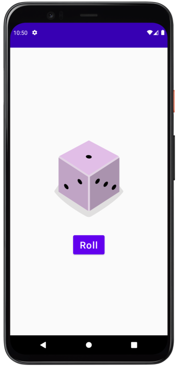  

### Bài tập thực hành: Chuyển ảnh cây chanh

- 1 cây chanh, click chọn 1 trái chanh
- Click trái chanh vắt chanh (random số lần vắt - 2->4), thành ly chanh
- Click ly chanh để uống. Click lần nữa để làm lại

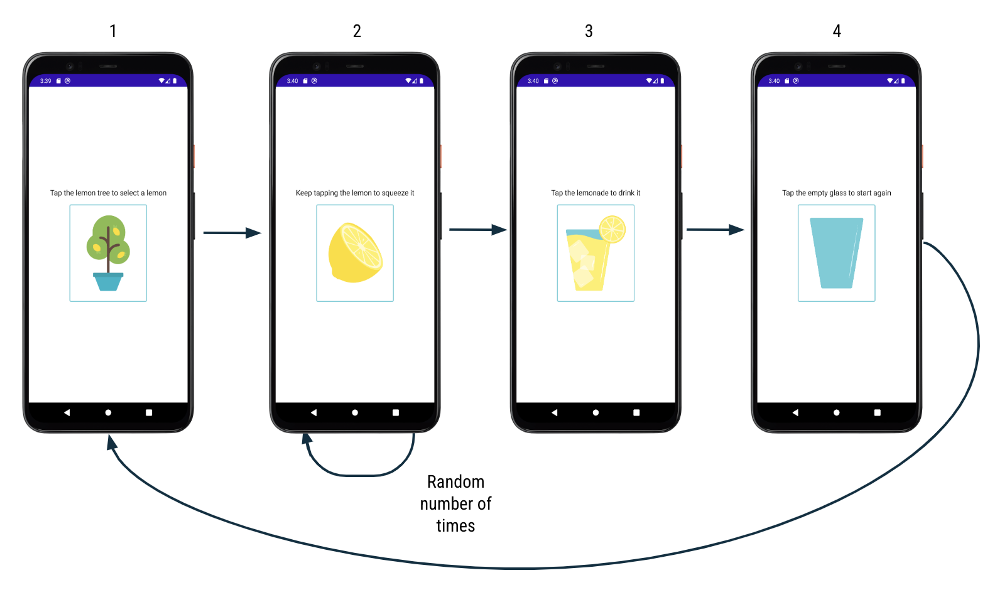
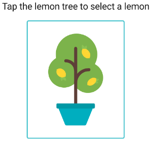
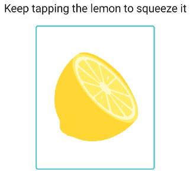
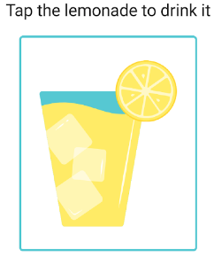
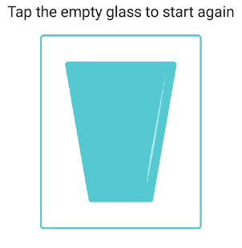

## Edit Text - Text View

### Hướng dẫn làm 

- Tính tiền tip 1 (Nhập số tiền, hiện số tiền tip (mấy % cũng được))
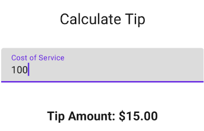

- Tính tiền tip 2 (nhập số tiền, nhập % tip, làm tròn số, xuất ra số tiền tip)
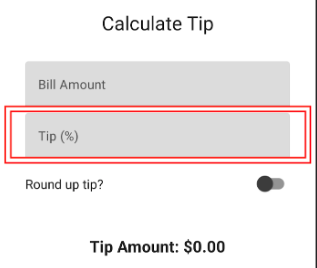

### Bài tập thực hành

- Màn hình xem ảnh

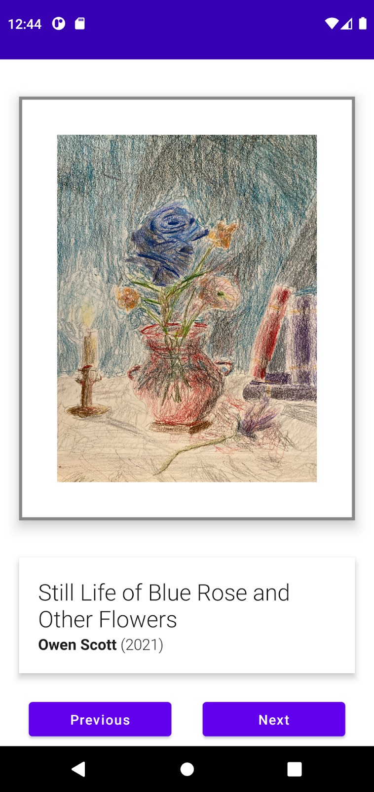

- Một cột 3 dòng (màu đỏ)
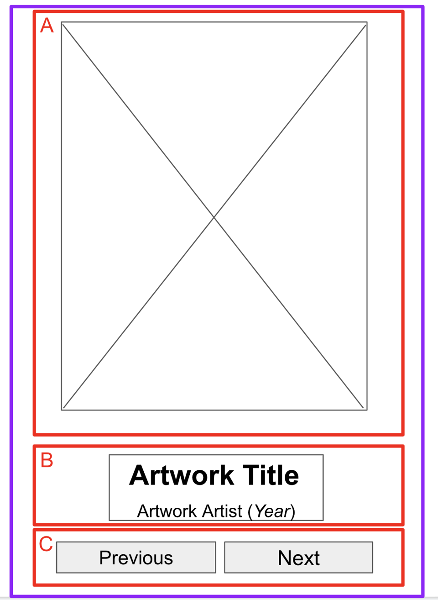

- Dòng 2 có 2 dòng (màu xanh)
- Dòng 3 có 2 cột (màu xanh)
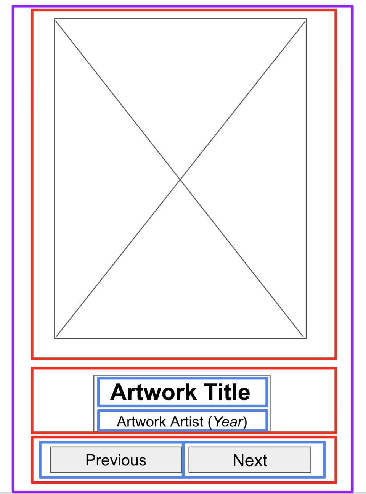

